# UML Class Diagram & Object-Oriented Architecture

## 1. Design Overview
The system achieves Senior-SDE modularity within the **two-source-file constraint** using encapsulated static nested classes, immutable Java records, and interface abstractions.

```mermaid
classDiagram
    class AntigravityFrontend {
        +main(String[] args)
        -runInteractiveShell(EngineFacade engine)
        -executeCommand(String[] args, EngineFacade engine)
        -handleHelp()
        -handleIngest(String[] args, EngineFacade engine)
        -handleSearch(String[] args, EngineFacade engine)
        -handleResearch(String[] args, EngineFacade engine)
        -handleSummarize(String[] args, EngineFacade engine)
        -handleKeywords(String[] args, EngineFacade engine)
        -handleStats(EngineFacade engine)
        -handleEvaluate(EngineFacade engine)
        -handleHealth(EngineFacade engine)
        -handleConfig()
    }

    class EngineFacade {
        -InvertedIndex index
        -Repository repository
        -RankingEngine rankingEngine
        -CorpusIngestionEngine ingestionEngine
        -ResearchOrchestrator researchOrchestrator
        -EvaluationEngine evaluationEngine
        +getInstance() EngineFacade
        +ingest(String path) int
        +search(String query, int k) List~SearchResult~
        +research(String question) ResearchReport
        +summarize(String docId, int sentences) String
        +keywords(String docId, int topN) List~Entry~
        +stats() SystemStats
        +health() HealthReport
        +evaluate() EvaluationMetrics
        +shutdown() void
    }

    class Document {
        <<record>>
        +String docId
        +String title
        +String source
        +String content
        +Map metadata
        +List tokens
        +Instant createdAt
    }

    class Posting {
        <<record>>
        +String docId
        +int termFrequency
        +List~Integer~ positions
    }

    class SearchResult {
        <<record>>
        +String docId
        +String title
        +double score
        +List~String~ matchedTerms
        +String snippet
        +String source
        +int rank
        +String explanation
    }

    class InvertedIndex {
        -Map~String, List~Posting~~ index
        -Map~String, Map~String, Integer~~ termDocFrequency
        -Map~String, Integer~ docLengths
        -Map~String, Double~ docVectorNorms
        -Map~String, Document~ documents
        +addDocument(Document doc) void
        +computeVectorNorms() void
        +getPostings(String term) List~Posting~
        +getDocumentFrequency(String term) int
        +getTermFrequency(String term, String docId) int
        +getCandidateDocIds(Collection terms) Set~String~
    }

    class TFIDFEngine {
        <<utility>>
        +calculateSmoothedIdf(int N, int df) double
        +calculateSublinearTf(int freq) double
        +calculateTfIdf(int freq, int N, int df) double
    }

    class SimilarityEngine {
        <<utility>>
        +calculateCosineSimilarity(Map queryWeights, double queryNorm, String docId, InvertedIndex index) double
    }

    class RankingEngine {
        -InvertedIndex index
        +search(String query, int topK, double minScore) List~SearchResult~
        +searchBM25(String query, int topK) List~SearchResult~
        +searchBaselineLexical(String query, int topK) List~SearchResult~
    }

    class TextRankSummarizer {
        <<utility>>
        +summarize(String text, int targetSentences) String
        -calculateSentenceSimilarity(Set wordsA, Set wordsB) double
    }

    class KeywordExtractor {
        <<utility>>
        +extractKeywords(Document doc, InvertedIndex index, int topN) List~Entry~
    }

    class ResearchPlanner {
        <<utility>>
        +generateSubQueries(String question) List~String~
        +createPlan(String question, List subQueries) List~String~
    }

    class EvidenceCollector {
        <<utility>>
        +collectEvidence(RankingEngine ranking, InvertedIndex idx, List subQueries, int topDocs) List~EvidenceSnippet~
        -isDuplicatePassage(String cand, Set existing) boolean
    }

    class ProvenanceManager {
        <<utility>>
        +assignCitations(List raw, Map citations) List~EvidenceSnippet~
    }

    class Repository {
        <<interface>>
        +saveDocument(Document doc) void
        +findDocumentById(String id) Optional~Document~
        +findAllDocuments() List~Document~
        +saveQueryLog(QueryLog log) void
        +saveResearchSession(ResearchSession session) void
        +isHealthy() boolean
        +getStorageMode() String
        +close() void
    }

    class MongoRepository {
        -MongoClient mongoClient
        -MongoDatabase database
        -MongoCollection docCollection
        +saveDocument(Document doc) void
        +findDocumentById(String id) Optional~Document~
        +isHealthy() boolean
    }

    class FileRepository {
        -Path storageDir
        -Path docsDir
        +saveDocument(Document doc) void
        +findDocumentById(String id) Optional~Document~
        +isHealthy() boolean
    }

    AntigravityFrontend --> EngineFacade
    EngineFacade --> InvertedIndex
    EngineFacade --> RankingEngine
    EngineFacade --> Repository
    InvertedIndex o-- Posting
    InvertedIndex o-- Document
    RankingEngine --> InvertedIndex
    RankingEngine ..> SimilarityEngine
    RankingEngine ..> TFIDFEngine
    RankingEngine ..> SearchResult
    Repository <|.. MongoRepository
    Repository <|.. FileRepository
    EngineFacade ..> TextRankSummarizer
    EngineFacade ..> KeywordExtractor
    EngineFacade ..> ResearchPlanner
    EngineFacade ..> EvidenceCollector
    EngineFacade ..> ProvenanceManager
```

