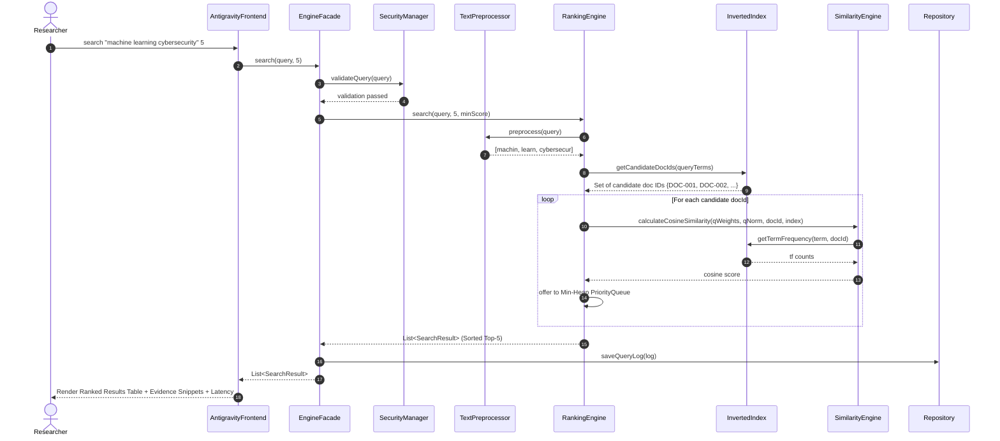
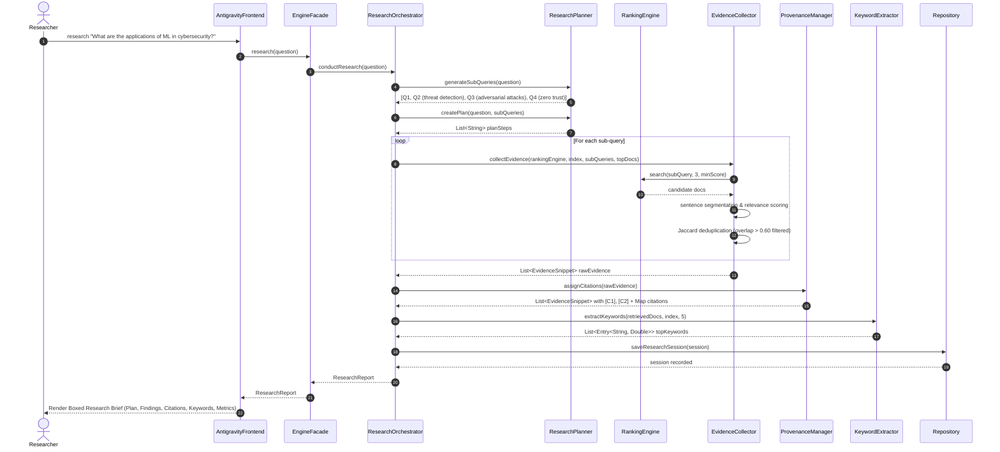

# UML Sequence Diagrams

## 1. Ranked Search Execution Sequence

```mermaid
sequenceDiagram
    autonumber
    actor User as Researcher
    participant CLI as AntigravityFrontend
    participant Facade as EngineFacade
    participant Sec as SecurityManager
    participant NLP as TextPreprocessor
    participant Rank as RankingEngine
    participant Idx as InvertedIndex
    participant Sim as SimilarityEngine
    participant Repo as Repository

    User->>CLI: search "machine learning cybersecurity" 5
    CLI->>Facade: search(query, 5)
    Facade->>Sec: validateQuery(query)
    Sec-->>Facade: validation passed
    Facade->>Rank: search(query, 5, minScore)
    Rank->>NLP: preprocess(query)
    NLP-->>Rank: [machin, learn, cybersecur]
    Rank->>Idx: getCandidateDocIds(queryTerms)
    Idx-->>Rank: Set of candidate doc IDs {DOC-001, DOC-002, ...}
    
    loop For each candidate docId
        Rank->>Sim: calculateCosineSimilarity(qWeights, qNorm, docId, index)
        Sim->>Idx: getTermFrequency(term, docId)
        Idx-->>Sim: tf counts
        Sim-->>Rank: cosine score
        Rank->>Rank: offer to Min-Heap PriorityQueue
    end

    Rank-->>Facade: List<SearchResult> (Sorted Top-5)
    Facade->>Repo: saveQueryLog(log)
    Facade-->>CLI: List<SearchResult>
    CLI-->>User: Render Ranked Results Table + Evidence Snippets + Latency
```

---

## 2. Autonomous Research Brief Sequence

```mermaid
sequenceDiagram
    autonumber
    actor User as Researcher
    participant CLI as AntigravityFrontend
    participant Facade as EngineFacade
    participant Orch as ResearchOrchestrator
    participant Plan as ResearchPlanner
    participant Rank as RankingEngine
    participant Evid as EvidenceCollector
    participant Prov as ProvenanceManager
    participant KW as KeywordExtractor
    participant Repo as Repository

    User->>CLI: research "What are the applications of ML in cybersecurity?"
    CLI->>Facade: research(question)
    Facade->>Orch: conductResearch(question)
    
    Orch->>Plan: generateSubQueries(question)
    Plan-->>Orch: [Q1, Q2 (threat detection), Q3 (adversarial attacks), Q4 (zero trust)]
    
    Orch->>Plan: createPlan(question, subQueries)
    Plan-->>Orch: List<String> planSteps
    
    loop For each sub-query
        Orch->>Evid: collectEvidence(rankingEngine, index, subQueries, topDocs)
        Evid->>Rank: search(subQuery, 3, minScore)
        Rank-->>Evid: candidate docs
        Evid->>Evid: sentence segmentation & relevance scoring
        Evid->>Evid: Jaccard deduplication (overlap > 0.60 filtered)
    end
    Evid-->>Orch: List<EvidenceSnippet> rawEvidence

    Orch->>Prov: assignCitations(rawEvidence)
    Prov-->>Orch: List<EvidenceSnippet> with [C1], [C2] + Map citations

    Orch->>KW: extractKeywords(retrievedDocs, index, 5)
    KW-->>Orch: List<Entry<String, Double>> topKeywords

    Orch->>Repo: saveResearchSession(session)
    Repo-->>Orch: session recorded
    
    Orch-->>Facade: ResearchReport
    Facade-->>CLI: ResearchReport
    CLI-->>User: Render Boxed Research Brief (Plan, Findings, Citations, Keywords, Metrics)
```
