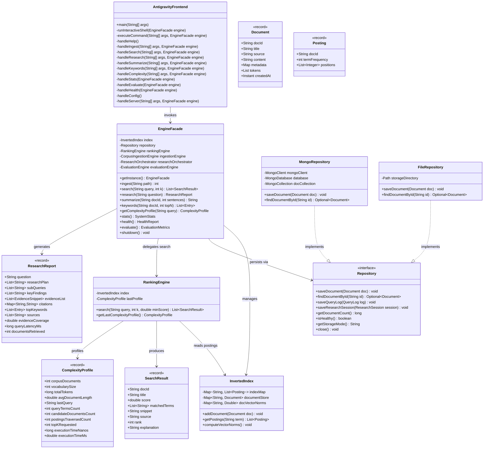

# UML Class Diagram & Object-Oriented Architecture

## 1. Design Overview
The system achieves Senior-SDE modularity within the **two-source-file constraint** using encapsulated static nested classes, immutable Java records, and interface abstractions.

---

## 2. Core Architectural Patterns Applied

1. **Facade Pattern (`EngineFacade`)**:
   Provides a clean, unified interface concealing subsystem complexity across ingestion, indexing, ranking, TextRank summarization, and MongoDB/file persistence.

2. **Repository Pattern (`Repository`, `MongoRepository`, `FileRepository`)**:
   Decouples data access from domain logic. Supports seamless, automatic failover from MongoDB Atlas to local JSON file storage.

3. **Strategy Pattern (`SimilarityEngine`)**:
   Encapsulates vector space scoring strategies, allowing isolated calculation of sublinear term frequency, smoothed inverse document frequency, and cosine dot products.

4. **Immutable Records**:
   All transfer objects (`Document`, `Posting`, `SearchResult`, `EvidenceSnippet`, `ResearchReport`, `ComplexityProfile`, `SystemStats`, `EvaluationMetrics`) are declared as Java records ensuring thread safety, zero mutation side effects, and concise serialization.
