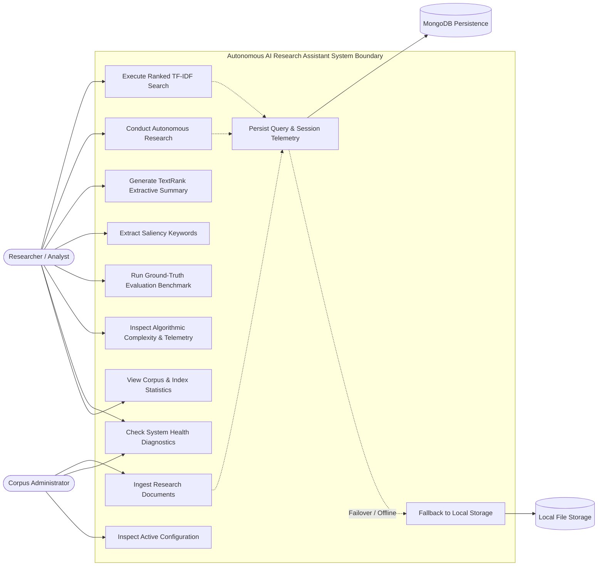

# UML Use Case Documentation

## 1. System Actor Identification
- **Researcher / Security Analyst**: Interacts directly with the CLI interface to query literature, launch autonomous research investigations, generate TextRank summaries, extract keywords, view complexity profiles, and benchmark retrieval metrics.
- **Corpus Administrator**: Ingests new research papers (.txt / .json), verifies system health diagnostics, and inspects index statistics.
- **MongoDB Persistence Layer (Secondary Actor)**: Stores document records, query telemetry, and research sessions when connected via TLS.
- **Local File Repository (Fallback Actor)**: Guarantees offline local persistence when MongoDB is unconfigured or unreachable.

---

## 2. Use Case Diagram

---

## 3. Detailed Use Case Specifications

### Use Case UC-3: Conduct Autonomous Research
- **Primary Actor**: Researcher / Security Analyst.
- **Preconditions**: Research documents ingested into Inverted Index.
- **Main Flow**:
  1. User enters natural language research question via CLI command `research "<question>"`.
  2. System validates input string length ($\le 500$ chars) and null-byte absence.
  3. `ResearchPlanner` decomposes the question into 3–5 conceptual sub-queries using deterministic domain taxonomy mappings.
  4. `RankingEngine` executes inverted index lookup and vector space scoring for each sub-query.
  5. `EvidenceCollector` extracts top-matching sentence passages from candidate documents.
  6. Passages with Jaccard token overlap $> 0.60$ are deduplicated.
  7. Passages are reranked by composite relevance.
  8. `ProvenanceManager` binds each evidence finding to verified citations (`[C1]`, `[C2]`).
  9. `KeywordExtractor` computes salient domain terms across retrieved evidence documents.
  10. System displays structured Autonomous Research Brief with Plan, Findings, Citations, Keywords, and Latency Metrics.
  11. Telemetry is saved to active persistence layer.
- **Postconditions**: Structured research brief rendered; zero hallucinated facts or citations generated.

### Use Case UC-6: Run Ground-Truth Evaluation Benchmark
- **Primary Actor**: Researcher / Evaluator.
- **Preconditions**: Evaluation dataset `data/evaluation/ground_truth.json` present on disk.
- **Main Flow**:
  1. User issues `evaluate` command.
  2. System iterates through labeled test queries.
  3. Executes dual retrieval: Enhanced Inverted Index TF-IDF vs Baseline Raw Lexical Overlap.
  4. Calculates Precision@5, Recall@5, F1-Score@5, Mean Reciprocal Rank (MRR), and Normalized Discounted Cumulative Gain (nDCG@5).
  5. Records execution times, sorting latencies to extract average and 95th percentile (P95) latency profiles.
  6. Displays comparative evaluation table with delta improvements.
- **Postconditions**: Genuine, measured metrics presented without fabrication.

### Use Case UC-7: Inspect Algorithmic Complexity & Telemetry
- **Primary Actor**: Researcher / Technical Reviewer / Student Evaluator.
- **Preconditions**: Inverted index populated with research literature.
- **Main Flow**:
  1. User issues `complexity [query]` command.
  2. System retrieves theoretical asymptotic bounds across all pipeline subsystems ($N, L, T, V, Q, M, K, S, I, P, R$).
  3. Executes sample query or specified query to capture empirical telemetry counters ($Q, M, P, K$, latency).
  4. Compares observed sparse candidate traversal against theoretical worst-case dense matrix scanning.
  5. Displays side-by-side asymptotic matrix, empirical metrics, and min-heap efficiency verification.
- **Postconditions**: Complete complexity profile displayed for academic defense and audit.
