# Research Workflow & Information Retrieval Pipeline

## 1. End-to-End Autonomous Pipeline

The following flowchart outlines the complete deterministic workflow executed during autonomous research queries:

```mermaid
flowchart TD
    Start([User Research Question]) --> ValidateInput[Input Validation & Sanitization]
    ValidateInput --> Decompose[Question Deconstruction & Domain Mapping]
    Decompose --> SubQueries[Generate 3-5 Focused Sub-Queries]
    
    subgraph MultiQueryRetrieval ["Multi-Query Retrieval Loop"]
        SubQueries --> ProcessQ[Preprocess Query Tokens]
        ProcessQ --> StemQ[Stop-Word Removal & Porter Stemming]
        StemQ --> InvLookup[Inverted Index Lookup]
        InvLookup --> CandPrune[Prune Non-Matching Documents]
        CandPrune --> CosineSim[Compute Sparse TF-IDF Cosine Similarity]
        CosineSim --> HeapRank[Min-Heap Bounded Top-K Selection]
    end

    HeapRank --> PassageExtract[Sentence-Level Passage Extraction]
    PassageExtract --> Deduplicate[Jaccard Near-Duplicate Filtering > 0.60]
    Deduplicate --> Rerank[Composite Relevance Reranking]
    Rerank --> TextRankGraph[Construct Sentence Similarity Network]
    TextRankGraph --> PageRankIter[Execute PageRank Power Iteration d=0.85]
    PageRankIter --> ExtractiveBrief[Extract Chronological Key Findings]
    ExtractiveBrief --> Provenance[Map Verified Source Citations C1, C2]
    Provenance --> KwExtract[Extract Topic Salience Keywords]
    KwExtract --> AssembleReport[Assemble Structured Research Report]
    AssembleReport --> PersistSession[Log Session to MongoDB / Local Storage]
    PersistSession --> OutputCLI([Render Polished CLI Visual Report])
```

---

## 2. Phase-by-Phase Breakdown

### Phase 1: Input Validation & Sanitization
- Ensures the user input does not contain null bytes, control character injections, or malicious escape codes.
- Bounds input length to a maximum of 500 characters to prevent denial-of-service or memory spikes.

### Phase 2: Deterministic Research Planning
- Analyzes question tokens against a curated taxonomy of technical concepts (cybersecurity, network intrusion, malware classification, information retrieval, extractive summarization, zero trust, multi-agent orchestration).
- Combines primary query with adjacent technical facets and pairwise token combinations.
- Produces up to 4 unique, focused sub-queries without invoking external stochastic LLMs.

### Phase 3: Inverted Index & Sparse Vector Scoring
For each sub-query:
1. **Tokenization & Normalization**: Strips punctuation and lowercases.
2. **Linguistic Filtering**: Removes 150+ syntactic stop words.
3. **Morphological Stemming**: Applies Porter stemmer algorithms to reduce variants to morphological roots (e.g., `classification` $\to$ `classifi`).
4. **Candidate Retrieval**: Inverted index maps terms to posting lists, bypassing non-relevant documents.
5. **Term Weighting**:
   $$w_{t, q} = (1 + \ln(f_{t, q})) \cdot \left(\ln\left(\frac{N + 1}{df(t) + 1}\right) + 1.0\right)$$
6. **Cosine Similarity**:
   $$\text{sim}(q, d) = \frac{\sum_{t \in q \cap d} w_{t, q} \cdot w_{t, d}}{\|\vec{q}\|_2 \cdot \|\vec{d}\|_2}$$
7. **Heap Pruning**: Min-heap retains top candidates in $O(M \log K)$ time.

### Phase 4: Sentence-Level Evidence Extraction & Deduplication
- Documents retrieved across sub-queries are segmented into individual sentences.
- Each sentence is scored against sub-query terms.
- Jaccard similarity is evaluated across collected candidate passages:
  $$J(A, B) = \frac{|A \cap B|}{|A \cup B|}$$
- If $J(A, B) > 0.60$, the redundant passage is eliminated to ensure diversity.

### Phase 5: TextRank Extractive Synthesis & Provenance Registry
- Builds a sentence adjacency matrix:
  $$W_{ij} = \frac{|T(s_i) \cap T(s_j)|}{\ln(|T(s_i)| + 1) + \ln(|T(s_j)| + 1)}$$
- Executes PageRank random-walk scoring until convergence ($\epsilon = 10^{-4}$).
- Selects the most central sentences and orders them according to document sequence.
- Assigns unique citation IDs (`[C1]`, `[C2]`, etc.) guaranteed to link to exact source documents present in the corpus.

### Phase 6: Persistence & Reporting
- Formulates the final `ResearchReport` containing findings, citations, keywords, and execution latency.
- Persists session telemetry to the active storage repository.
- Renders the structured output to the Java CLI interface.
